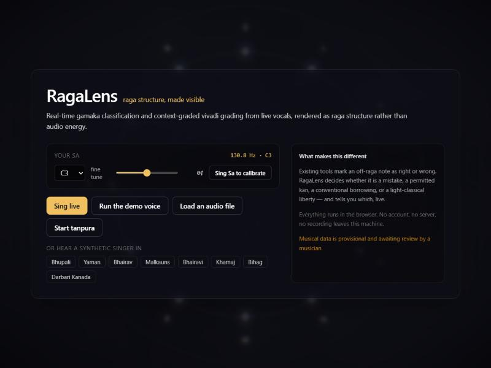
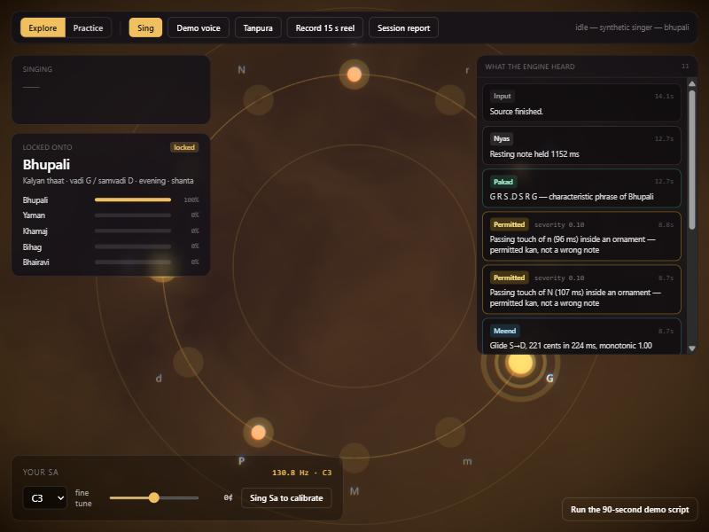
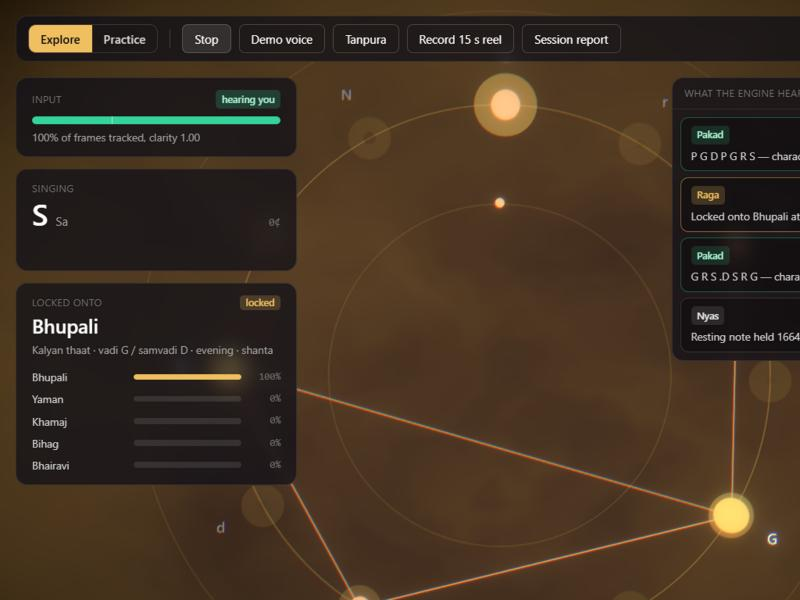

# RagaLens

**A real-time system that listens to Indian classical vocals, classifies gamaka types, grades off-raga notes *by context* — mistake, permitted embellishment, or stylistic usage — and renders raga structure, not audio energy, as a generative visual scene.**

Entirely client-side. No account, no server, no database. Nothing you sing leaves your machine.



```bash
npm install
npm run dev     # http://localhost:5173
```

---

## Table of contents

1. [Why we built this](#1-why-we-built-this)
2. [The core novelty](#2-the-core-novelty)
3. [What it's actually for](#3-what-its-actually-for)
4. [How to use it](#4-how-to-use-it)
5. [Reading the screen](#5-reading-the-screen)
6. [How the analysis works](#6-how-the-analysis-works)
7. [Architecture](#7-architecture)
8. [The raga knowledge base](#8-the-raga-knowledge-base)
9. [Tests](#9-tests)
10. [Limitations](#10-limitations)
11. [References](#11-references)

---

## 1. Why we built this

Every pitch-feedback tool for Indian classical music makes the same mistake: it treats a raga as a **set of allowed notes**, and anything outside that set as an error.

That is musically false, and it fails students in a specific and damaging way.

Consider a singer performing Raga Bhupali, whose notes are **S R G P D**. Shuddha Ni is *varjya* — forbidden. Now they sing a meend gliding from Dha up to the upper Sa, brushing through Ni for eighty milliseconds on the way. Every tuner on the market flags that as a wrong note. It is not. It is a **kan** — a grace touch — and it is exactly what the phrase is supposed to sound like.

Or take Raga Yaman, which uses tivra Ma. A singer descends through the phrase `G m G R S`, using *shuddha* Ma. A binary checker calls this an error. In fact it is **Yaman Kalyan**, a recognised and admired variant, and that single phrase is the whole reason the variant has a name. Sing the same shuddha Ma anywhere *else* in Yaman and it really is a mistake.

The note is identical. The verdict is opposite. **The difference is context**, and no existing real-time tool models it.

So a learner using these tools is trained to flatten their music: avoid ornaments, avoid idiom, sing the scale, score well. The feedback actively punishes the thing that makes the music what it is.

RagaLens was built to see whether a system could make that distinction live — and explain itself every time.

---

## 2. The core novelty

> **Claim.** A real-time system that classifies gamaka types and context-graded vivadi usage from live vocals, and renders raga structure as a generative visual scene, distinguishing a mistake from an aesthetically permitted deviation.

| Prior work | What it does | What RagaLens adds |
|---|---|---|
| Chordia & Rae, NIME 2008; Ragawise (CompMusic, 2015) | Real-time raga likelihood bars | Structure-driven generative visuals instead of bar charts |
| ShrutiSense (2025) | Offline grammar-constrained correction; treats varjya notes as binary | **Context-graded vivadi**, live |
| NITK gamaka HMM (Vyas et al., IC3 2015) | Offline gamaka detection | **Live gamaka-type classification** driving visual primitives |
| Project Alaap | Hand-crafted, pre-rendered raga art | Live, analysis-driven scene |
| Riti / SwarMeter / Swara AI apps | Pitch accuracy feedback | Raga-grammar-aware feedback that knows an embellishment isn't a mistake |

Four verdicts, not two:

| Verdict | Meaning | Example |
|---|---|---|
| **Mistake** | Genuinely outside the raga | Shuddha Ma sustained 500 ms in Bhupali |
| **Permitted** | A fleeting touch inside an ornament | 80 ms of Ni inside a meend D→S′ in Bhupali |
| **Stylistic** | A conventional borrowing, or a light-classical liberty | Shuddha Ma in `G m G R S` (Yaman Kalyan); shuddha Re in Bhairavi |
| **Direction** | In the raga, but illegal in that direction | Re taken in the *ascent* of Khamaj |

Severity scales with duration and whether the note was a resting note — a half-second drone on a foreign note is weighted far more heavily than a passing brush.

**Every verdict carries a human-readable reason**, generated by the engine and shown verbatim in the UI. Nothing is a black box:

> *"shuddha Ma in G m G — accepted usage. Shuddha Ma belongs to Yaman Kalyan and is accepted in the descending phrase G m G R S; anywhere else it is a mistake in Yaman."*

---

## 3. What it's actually for

**For a student practising alone.** The common failure mode of solo practice is drifting out of a raga without noticing — and the second failure mode is being told off by software for ornaments that were correct. RagaLens gives running feedback that distinguishes the two, with the reasoning attached, so you learn the grammar rather than just a scale.

**For a teacher demonstrating.** The Yaman Kalyan moment — the same note, the opposite verdict — makes a point about context-dependence in thirty seconds that is otherwise hard to show without singing it yourself twice and explaining the difference.

**For seeing shape rather than hearing it.** Because angle encodes pitch class and radius the octave, a meend draws itself as an arc and a kampita as a tight zig-zag. Ornaments become shapes you can point at, which is useful for anyone whose ear is still developing.

**For research.** The engine is pure TypeScript with no DOM, every threshold sits in one config file, and all raga knowledge is a single JSON file. It is a working testbed for context-aware music grammar that happens to have a renderer attached.

### What it is not

It is **not an authority on raga**, and it should not be used to settle a disagreement with a teacher. The musical data is provisional (see [§8](#8-the-raga-knowledge-base)), gharana practice varies, and several encoded judgements are legitimately contested. It is a mirror and a practice aid, not an examiner.

---

## 4. How to use it

### Install and run

```bash
npm install
npm run dev
```

Open **http://localhost:5173** in Chrome or Edge. `npm run build` produces a static bundle in `dist/` that can be dropped on any host.

### Fastest possible look

Click **Run the demo voice**, then **Session report**. A synthetic singer performs Bhupali and you see the whole pipeline work. No microphone required.

### The full demo — 90 seconds

Click **Run the 90-second demo script**. Five captioned steps:

1. **Bhupali takes shape** — the pakad `G R S .D S R G` locks the raga; the palette morphs to evening gold.
2. **A permitted kan** — a meend D→S′ brushes shuddha Ni → gold glint, *"permitted kan, not a wrong note"*.
3. **A real mistake** — shuddha Ma sustained → red crack and a glitch pulse, *"absent from Bhupali"*.
4. **Yaman Kalyan** — `G m G R S` → violet ripple, *"accepted usage"*.
5. **Bhairav at dawn** — andolan on komal Re and komal Dha → breathing rings, dawn palette.

**Steps 3 and 4 are the point of the whole project.** Same kind of foreign note, opposite verdicts, because the context differs.

### Singing into it

**Step 1 — Set your Sa.** Bottom-left. Pick from the dropdown (C3 suits most male voices, G3–C4 most female), or press **Sing Sa to calibrate** and hold the note for three seconds.

> Get this right before anything else. Every verdict is measured in cents from your Sa, so a wrong tonic makes the entire analysis wrong.

**Step 2 — Start the tanpura.** It auto-tunes to your Sa and keeps you anchored. The engine ignores it.

**Step 3 — Switch to Practice and choose your raga.** Practice grades you against *your* choice from the very first note. Explore mode instead tries to identify what you're singing, which costs a few seconds of guessing at the start.

**Step 4 — Press Sing** and allow microphone access.



### If nothing appears

Watch the **Input** panel at the top left. The pitch gates reject frames silently, so a dead microphone and a flawless performance would otherwise look identical — an empty feed. The panel names whichever gate is rejecting you:

| Reading | Meaning | Fix |
|---|---|---|
| **too quiet** | Below `config.silenceRms` | Move closer, or raise the input level in your OS sound settings |
| **no clear pitch** | Loud enough, but below `config.clarityMin` | Sing a sustained vowel; or lower `clarityMin` in `src/engine/config.ts` |
| **hearing you** | Working, with % of frames tracked | — |



`clarityMin` defaults to `0.85`, which is strict for a real voice — it was tuned against a synthetic one. Dropping it to `0.7` is the single most useful knob if the engine isn't tracking you. Vite hot-reloads the change.

### Getting your work out

- **Session report** — time in raga, verdict counts, where your voice spent its time (red bars are outside the raga), gamakas by type, a confidence timeline, and every verdict with its reason.
- **Export JSON** — the complete session: notes, gamakas, verdicts, statistics.
- **Record 15 s reel** — captures the scene *with* audio to `.webm`. Start it a few seconds before the moment you want.

### Practical tips

Sit close to the microphone. Sing sustained notes and clear phrases rather than fast taans — the segmenter needs 80 ms to call something a note. Verdicts arrive about a third of a second late by design: the grader needs to hear the *next* note before it can judge the current one in context.

---

## 5. Reading the screen

Angle encodes **pitch class** (Sa at twelve o'clock, going clockwise). Radius encodes the **octave**. Everything the scene draws derives from those two functions, so the picture is a projection of raga structure rather than of loudness.

| Musical structure | Visual |
|---|---|
| 12 swaras | Radial mandala; only the raga's own swaras glow once locked |
| Vadi / samvadi | Larger, permanently pulsing anchors |
| Live pitch | A polar trail fading over 4 s — a meend draws its own arc, a kampita its own zig-zag |
| Nyas (resting note) | The node blooms with a slow outward ripple |
| **Meend** | Luminous tube arc between the two nodes |
| **Kampita** | Particle shimmer trembling at the measured rate |
| **Andolan** | A ring breathing at the measured sway rate |
| **Murki / kan** | Spark burst / satellite flick |
| **Mistake** | Red crack shards + a glitch pulse scaled by severity |
| **Permitted** | Gold glint |
| **Stylistic** | Violet ripple |
| **Direction violation** | Orange flare; the trail flashes orange |
| Raga lock | A 2 s palette morph — colour from the *samay* (time of day), motion speed and turbulence from the *rasa* |
| Pakad match | The mandala turns once; a constellation line joins the phrase notes |

Swara labels are drawn into canvas textures rather than DOM overlays, so they are part of the WebGL frame — they survive the reel export, and the app needs no webfont and works offline.

---

## 6. How the analysis works

### Gamaka classification — `src/engine/gamaka.ts`

Features per contour: duration, full extent, a p10–p90 **robust** extent (so the approach ramp into an oscillation doesn't inflate it), monotonicity over meaningful steps, oscillation rate from detrended zero crossings, extremum count, and the set of distinct swaras touched.

Rules, first match wins:

| Type | Condition |
|---|---|
| *(plain step)* | Short, staying inside the interval it spans → a note change, not an ornament |
| **kan** | < 120 ms, touches a neighbour, lands on the target |
| **murki** | 120–400 ms, ≥ 3 turns, ≥ 3 distinct swaras |
| **meend** | Monotonicity > 0.8, extent ≥ 90 cents, ≥ 150 ms |
| **kampita** | 4–9 Hz, robust extent 50–250 cents, ≥ 2 cycles |
| **andolan** | 0.8–3 Hz, robust extent 20–70 cents, ≥ 600 ms |

Confidence is the normalised margin by which features sit inside their thresholds. Long steady notes are re-tested for a slow andolan, because a 1.5 Hz sway passes the stability gate.

### Raga recognition — `src/engine/recognizer.ts`

Per note, weighted by duration: a pitch-class log-likelihood from a per-raga template (vadi ×3, samvadi ×2, nyas ×1.5, allowed ×1, conditionally-allowed ×0.4, dissonant ε); a bonus when the bigram is legal in the current direction; a penalty for direction-rule violations; a strong bonus for a fuzzy pakad match (Levenshtein ≤ 1); and a bonus when an andolan lands on a note the raga expects to carry one — which is what separates Bhairav from Kalingda, and Darbari from Adana.

Evidence decays with a 20-second half-life, so the belief is revised live. Softmax gives the posterior; the raga locks when the top candidate holds above 0.6 for two seconds.

### Context-graded vivadi — `src/engine/vivadi.ts`

For an in-raga note, only a direction rule can flag it. For an out-of-raga note:

1. Shorter than 120 ms, inside an ornament, neighbours in-raga → **embellishment** (severity 0.1)
2. A `conventional` rule *and* the sung context matches a sanctioned phrase → **stylistic** (0.15); the same note outside that phrase → **mistake**
3. An `optional` rule → **stylistic** (0.3) — a light-classical liberty
4. `embellishment_ok` and under 250 ms → **embellishment** (0.2); sustained → **mistake**
5. Otherwise → **mistake**, severity scaled by duration and nyas status

Short `allowedContexts` patterns must match **exactly**. With one edit allowed, `G m P` would be accepted as `G m G` — destroying the very distinction the grader exists to make.

---

## 7. Architecture

```
Mic / audio file / synthetic singer
        │  AudioWorklet: 2048-sample frames, hop 512 @ 44.1 kHz ≈ 11.6 ms
        ▼
[Worker] pitchy (MPM) → confidence + RMS gate → 5-tap median → gap bridging
        │  PitchFrame stream (~86 fps), cents relative to the tonic
        ▼
[Worker] Segmenter → steady NoteEvents + transient segments
        │
        ├──► Gamaka classifier ────────► GamakaEvent
        ├──► Raga recognizer ──────────► RagaPosterior
        └──► Vivadi grader ────────────► VivadiEvent
        │
        ▼  postMessage batches every 50 ms, deduplicated by event identity
[Main] Zustand store ──► three.js scene + HUD + explanation feed + session log
```

```
src/
├── audio/        AudioContext graph, tanpura drone, synthetic singer
├── engine/       all music logic — pure TS, no DOM, unit-testable
│   ├── config.ts     every tunable threshold; no magic numbers elsewhere
│   ├── pitch.ts      gating, median filter, gap bridging
│   ├── segmenter.ts  steady notes vs transient segments
│   ├── gamaka.ts     rule-based gamaka classifier
│   ├── recognizer.ts streaming raga posterior
│   ├── vivadi.ts     ★ context-graded vivadi grading
│   ├── analyze.ts    orchestration, shared by the worker and the tests
│   └── worker.ts     message protocol, dedupe, batching
├── data/         ragas.json + zod validation
├── visual/       mandala, trail, gamaka FX, vivadi FX, atmosphere shader
└── ui/           landing, tonic calibrator, input meter, HUD, feed, report
public/ragalens-capture.js   the AudioWorklet (plain JS, loaded by URL)
```

Two decisions worth calling out:

**One analysis path, not two.** The worker runs the *same* `analyze()` the unit tests call, over a rolling 14-second window. There is no separate "live" implementation to drift out of sync with the tested one.

**Dedupe by identity, not timestamp.** Re-analysing a window means each event is recomputed many times, and its boundaries jitter by a frame as the window slides. A plain time watermark re-emits the same meend repeatedly. The worker instead remembers each emitted event by *what it is*, and suppresses a candidate whose identity was already emitted recently.

Rule-based and explainable throughout, deliberately — every output carries a `reason` string, which an ML classifier of this size could not provide.

---

## 8. The raga knowledge base

Eight ragas in `src/data/ragas.json`, zod-validated at load: **Bhupali, Yaman, Bhairav, Malkauns, Bhairavi, Khamaj, Bihag, Darbari Kanada.** Each carries its swara set, aroha/avaroha, vadi/samvadi, nyas notes, pakad phrases, andolan notes, graded vivadi rules, direction rules, samay and rasa.

> ### ⚠️ The musical data is provisional
>
> It was assembled from standard textbook descriptions to drive this demo and has **not been reviewed by a practising musician or musicologist.** Treat every rule as subject to revision — especially the `conventional` and `optional` categories, which are precisely what decide whether a note is reported as a mistake or as permitted usage. Gharana practice varies, and several of these judgements are legitimately contested.
>
> **Reviewers: edit `ragas.json` only.** Nothing else in the engine hard-codes musical facts, and all thresholds live in `src/engine/config.ts`. Corrections are very welcome as issues or pull requests.

Notation: `S r R g G m M P d D n N`, lower octave prefixed `.`, upper octave suffixed `'`.

---

## 9. Tests

```bash
npm test
```

34 Vitest cases run against contours generated by `src/engine/contour.ts` — the same pure code the synthetic singer renders to audio, so the tests and the demo voice agree by construction.

- meend G→P → `meend`, confidence > 0.7
- 6 Hz ±100 cent oscillation on R → `kampita`
- 1.5 Hz ±20 cent sway on komal Re → `andolan`
- Fast multi-swara cluster → `murki`; sub-120 ms flick → `kan`; plain steady note → `none`
- Bhupali + shuddha Ma sustained 500 ms → `mistake`
- Bhupali + short shuddha Ni inside a meend D→S′ → `embellishment`
- Yaman `G m G R S` → `stylistic`; shuddha Ma elsewhere in Yaman → `mistake`
- Bihag `P M G m G` → `stylistic`; Bhairavi shuddha Re → `stylistic`, severity ≤ 0.3
- Khamaj ascending `S R G` → `direction_violation`; descending `G R S` → clean
- Recogniser: a ~15 s synthetic passage per raga → correct top-1 for **8 of 8**
- Bhupali locks from its own pakad; practice mode grades against the chosen raga regardless of the posterior

---

## 10. Limitations

- The tonic is set by hand or by a three-second calibration. There is no automatic tonic detection.
- **Monophonic voice only.** A concert recording with tanpura, tabla and harmonium will confuse the pitch tracker; there is no source separation.
- Gamaka classification is rule-based and threshold-driven, not learned. It is explainable and fast, and it will mis-call ornaments sitting on a threshold.
- Eight Hindustani ragas from textbook descriptions. No Carnatic ragas, and no gharana-specific variation.
- Pakad matching uses a 12-note window of steady notes, so it misses phrases delivered entirely as ornament.
- The default `clarityMin` of 0.85 is tuned to a synthetic voice and is strict for real singing.
- Reel export is `.webm` (Chromium, Firefox). Safari's `MediaRecorder` support on canvas streams is inconsistent.

### Future work

Automatic tonic detection from polyphonic recordings; source separation for concert audio; an ML gamaka classifier trained on Saraga; the Carnatic raga set and its far richer gamaka taxonomy; multi-user sessions; a mobile app.

---

## 11. References

- Parag Chordia and Alex Rae. *Real-time raag recognition for interactive improvisation.* NIME 2008.
- Ragawise — real-time raga recognition, CompMusic / Music Technology Group, 2015.
- ShrutiSense: microtonal grammar-constrained correction for Indian art music. arXiv:2508.01498.
- Vyas et al. *Gamaka detection in Hindustani music using HMMs.* IC3 2015.
- Korade et al. NLP4MusA 2024.

Built with Vite, React, TypeScript, Zustand, three.js / react-three-fiber, pitchy, zod, Tailwind, Recharts and Vitest.
